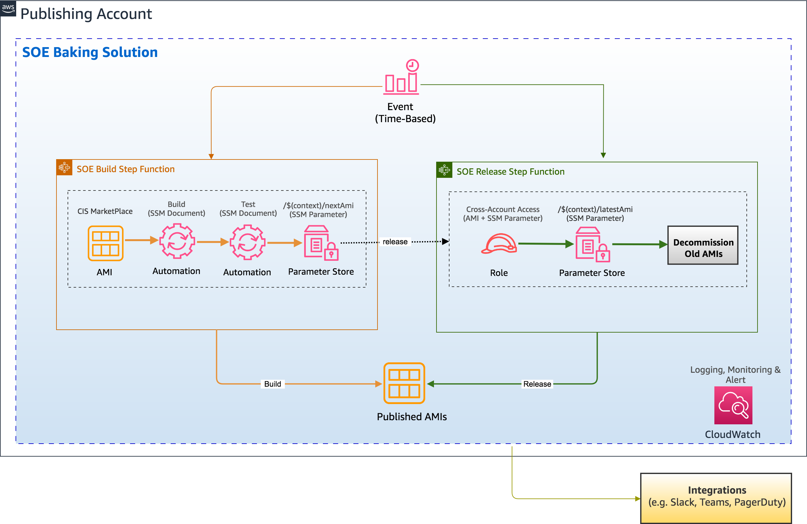

# Reference solution for SOE Linux AMI Baking

&nbsp;

## Overview 
&nbsp;

## Publishing
*publishing* folder contains reference solution for creating and releasing new SOE AMIs for specific types of Linux operating systems, referred to as the "SOE type". 
The AMIs are: 

	- Hardened
	- Patched
	- QA / Compliance Tested
	- Scanned for high security vulnerabilities

These AMIs are created on a schedule basis and are made available to a member AWS account which can then consume this AMI for its sample EC2 application stack. This can further be expanded to share this AMI with multiple accounts or across organisation.	

This repository contains code to deploy a solution code to deploy SOE baking solution.

AMIs include the following agents and software packages:

	- AWS Inspector 
	- AWS SSM
	- AWSlogs (CloudWatch)
	- AWS Corretto (JRE)
	- AWS CodeDeploy
        	

&nbsp;
As a part of this solution it mainly deploys two step functions
+ SOE Build Step Functions
    - First it performs build automation document which is a System Manager automation type document. Using this document it orchestrate following configurations
        -  It updates the OS, installs common agents as listed above as well as  AWS Corretto (JRE). 
        -  It then cuts a new AMI. Once the AMI is build it pushes the new AMIId into a parameter store "$(context)/nextAMI".
    - Then it tests this new AMI using Test automation document
        - It first uses Inspector Assessment test to scan for any High/Critical Vulnerabilities
        - It then uses Chef Inspec test to check that the agets and softwares which are installed are indeed present
    - Finally it copies this new AMI into $(context)/nextAMI" parameter store

+ SOE Release Step Functions
    - This step function, uses the AMI build by the build step function above and then releases/publishes it. 
        - It fetches this AMI from the parameter store "$(context)/nextAMI".
        - It shares this AMI with the member account for cross account access
        - It publishes this AMI Id into a new parameter store "$(context)/latestAMI" to make it available for the consumption
        - It also sets up a role to access "$(context)/latestAMI" via cross account asuume role from member accounbt. The member account then uses this parameter store value to fetch new AMI ID.

The solution also deploys cloudwatch services additionally as below

- *Cloudwatch dashboard* to collect metrics for build and release step function runs
- *Cloudwatch rule* to pass the parameter store change cloud event to the member account event bus
- *SNS* notifications to notify success/failures

&nbsp;

## Hight Level Architecture Diagram


##  Folder Structure within publishing folder
&nbsp;

`stack/app/src` - Solution code source

`stack/app/test` - Solution unit test files
  

&nbsp;
## Prerequisites
&nbsp;


### Multiaccount
This solution is tested in multi account setup. So it is recommended to use two accounts.
- One account where you deploy this solution
- Another account which you nominate as member account, where we can set up cross account access as well as send some events on event bus

### Event bus in member account
Ensure that the default event bus in the member account of your choice is setup with allowing access from this account where you deploy the baking solution. Basically you would require to allow publishing account to publish event to the event busy in member account.

Follow this [link] (https://docs.aws.amazon.com/AmazonCloudWatch/latest/events/CloudWatchEvents-CrossAccountEventDelivery.html) to understand how to setup event bus. 


### Source AMI
Note: We are using **CIS hardened AMI** built upon Amazon Linux2 and Level 1 CIS benchmark configuration as a source AMI. The solution may not work with any other AMI which is not hardened as it will result in inspect test failing in its assessments.

### Permission
&nbsp;

In order to test deploying this solution to your account it would be advisable that you use user with **Administrator Access** for smooth testing.


&nbsp;
### Softwares
&nbsp;

- AWS CLI
- Python 3.*
- Pytest, if you want to perform unit testing on python code


&nbsp;
### Deploying the Solution
&nbsp;
Follow steps as below

#### Set environment variables
```
Set credentials/profile for the AWS account you want to deploy this solution before running any make commands
```
&nbsp;
#### Set cloudformation parameter inputs 
**IMPORTANT**
Below are the parameters in the **publisbhing/Makefile** that you need to provide  with your own custom values for. Rest of the parameter values you can keep it untouched.

```
- MemberAccountId:<< Input your value here >>
Provide the member account ID you want to share the AMI with. This will the account then you can run consumption of the AMI.
If you want to setup Slack Integration, please provide values for the below
- SlackChannel=<< Input your value here >>
- SlackURL=<< Input your value here >>
- SlackIcon=<< Input your value here >>
- UseSlackIntegration=true
```
&nbsp;
#### Deploy/Update Solution
From the publishing folder, run:
```
cd publishing (ensure you are in publishing folder)
make deploy-stack
```
&nbsp;
###  Running syntax tests
To run a syntax test on CFN templates for the CICD pipeline and solution:
```
cd publishing (ensure you are in publishing folder)
make test-cfn
```

&nbsp;

##  Notifications
&nbsp;
You can also integrate with slack for build and release step function notifications. For this please provide required inputs in the **makefile** for
- SlackChannel
- SlackUrl
- SlackIcon

If you do not wish to integrate with slack then please set
    UseSlackIntegration=true


###  InSpec Compliance Tests
&nbsp;

The bucket (pInspecTestFilesBucket) that hosts the InSpec tests resides in the account where the AMI is built.

The compliance test is a Ruby file that uses the [InSpec DSL](https://www.inspec.io/docs/reference/dsl_inspec/) gets executed during the test phase of the AMI build process. The SSM document that runs the test is **AWS-RunInspecChecks** which takes in 2 parameters, namely, sourceType and sourceInfo. S3 is the source type provided and the source info is a dictionary object that provides the *https* path to the file.

The SSM document takes care of installing and running InSpec on the instance and then registers the instance as compliant or non-compliant. The SSM document doesnt return the result of the test but instead the Step Function calls the SSM Compliance APIs to determine whether the test was successful. The test is successful when the result is **'COMPLIANT'**.

&nbsp;
#### Running Standalone InSpec Tests
&nbsp;

To run standalone InSpec tests, call the run command **AWS-RunInspecChecks** and pass the parameters as below:

`{"path":"https://s3-ap-southeast-2.amazonaws.com/my-inspec-bucket/inspec/linux_soe_compliance.rb"}`

&nbsp;
###  Adding a new agent using SSM command document
&nbsp;

Open ami-baking-lnx-amzn-soe-sam-cf.yaml file go to SSM Documents Section.

Create a new command document based on the installation steps of the new agent or software

Call the new command document from rAutomationDocBuildLinuxAMI by adding a runCommand that references the new command document.

**Note:** For any agent or procedure changes we must write tests.

&nbsp;
###  Making changes to the SOE
&nbsp;

Open ami-baking-lnx-amzn-soe-sam-cf.yaml file go to SSM Documents Section.

Identify the command document reference to the agent/software/configuration that requires an update.

Apply your change and update the existent tests on [linux_soe_compliance.rb](stack/app/test/functional/linux_soe_compliance.rb). If test is not present, please a test.

**Note:** For any agent or procedure changes we must write tests.

&nbsp;
### Writing Inspec test for agent and procedures
&nbsp;

Open [linux_soe_compliance.rb](stack/app/test/functional/linux_soe_compliance.rb) and add the require checks to test the new agent and procedures.

Please see InSpec Compliance Tests section for more details.

&nbsp;
###  Build a SOE from a specific AMI 
&nbsp;
Set OVERRIDE_AMI to the AMI ID to be used and update the pipeline
```
export OVERRIDE_AMI=123456
make deploy-pipeline
```

&nbsp;
###  Executing Individial SSM Command Documents
&nbsp;
To make the test and development process faster, it is possible to execute individial Command documents rather than running the entire Automation document, refer to [document types](https://docs.aws.amazon.com/systems-manager/latest/userguide/sysman-ssm-docs.html).

Depending on the Command document, you may or may not have to pass a parameter to the document.

&nbsp;


&nbsp;
## Developer:
* Vrushank Jani